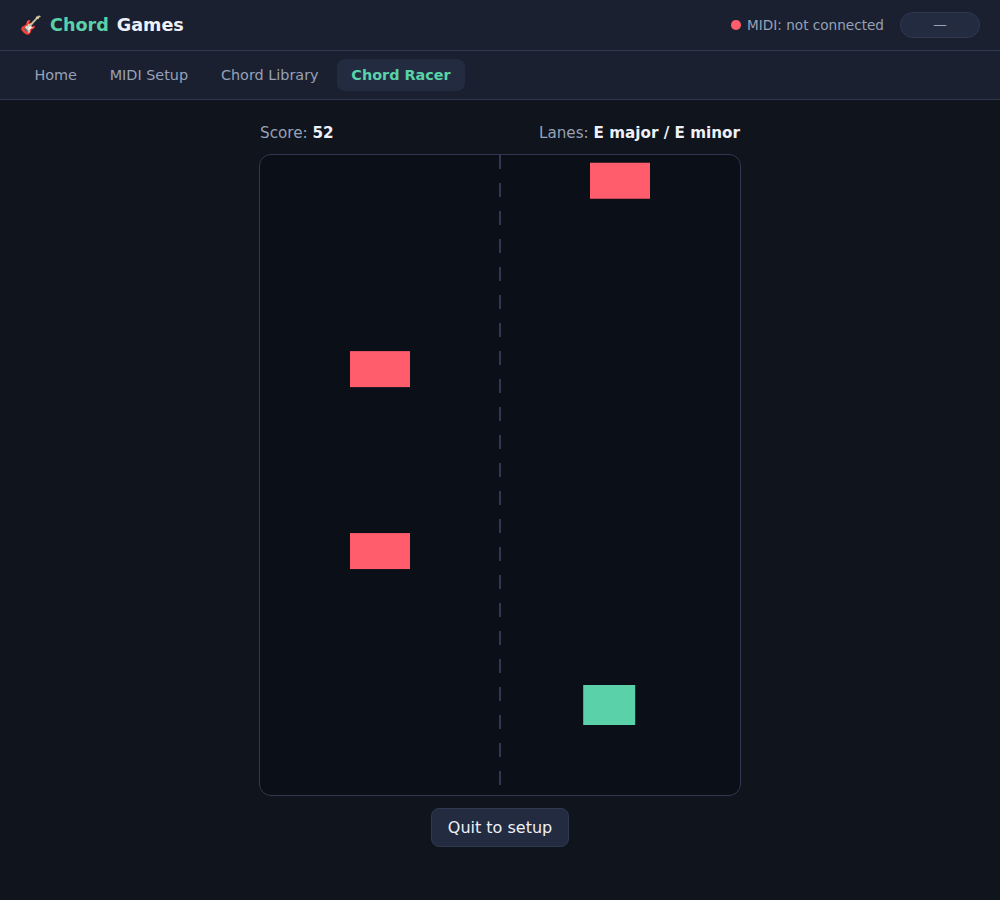

# Chord Games

Browser-based games controlled by chords played on a real electric guitar,
read via a Roland GP-50 (or any other MIDI source) over the **Web MIDI API**
— no microphone/pitch-detection involved, so recognition is as accurate as
your gear's own note tracking.



*Chord Racer mid-run — car (green) steers into whichever lane's chord is currently
held, dodging obstacles (red) as speed ramps up. Captured using the keyboard
fallback since no physical GP-50 was available in this environment.*

## How it works

1. Connect your GP-50 (with a GK-equipped guitar/pickup) to your Mac via a
   MIDI interface. The GP-50 sends a MIDI note per string it hears.
2. This app listens to raw MIDI note on/off events (`src/midi/midiManager.js`),
   tracks which notes are currently held, and after a short debounce matches
   the held note set against a library of known chords
   (`src/chords/chordDetector.js`) using pitch-class overlap scoring.
3. Games subscribe to chord-change events and react — e.g. Chord Racer steers
   a car into whichever lane's assigned chord you're currently holding.

## Running it

```sh
npm install
npm run dev
```

Open the printed URL in **Chrome or Edge** (Safari does not support the Web
MIDI API). Go to **MIDI Setup** to select your GP-50/interface and confirm
notes show up live, then **Chord Library** to see/customize which chords are
recognized, then play **Chord Racer**.

## Customizing chords

The default library (`src/chords/defaultChords.js`) assumes standard tuning
and open-position voicings with no transpose on the GP-50. If your setup
reports different absolute MIDI pitches, use **Chord Library → Re-record**
(or **Add a new chord**) to capture the exact notes your gear sends for a
given shape — the app matches on whatever you record, not on music theory.

No physical GP-50 was available while building this, so the MIDI plumbing is
implemented directly against the Web MIDI API spec and covered by the fake
note-event flow, but real-hardware verification (exact note numbers your
GP-50 sends per string/channel, timing feel of the strum debounce) is still
worth doing on your end — tweak `SETTLE_MS`/`MATCH_THRESHOLD` in
`chordDetector.js` if strums feel laggy or chords misfire.
